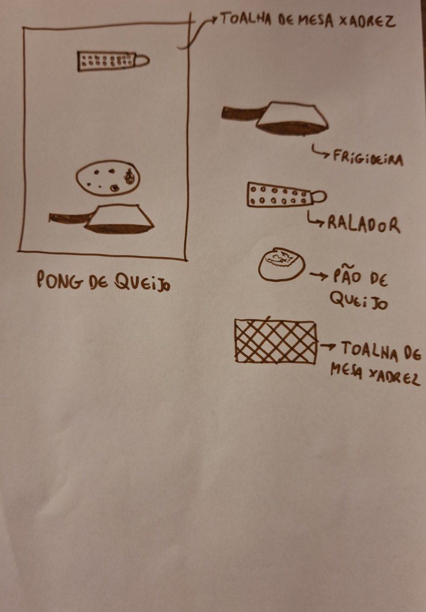

# Relatório - Reinventando Pong

## 1. Introdução  

A atividade Reinventando Pong traz a iniciativa de promover a criatividade e a inovação incremental nos estudantes. A abordagem da nossa dupla (Cauã Pirilo Asquino e Mychel Lopes Segrini) foi de, primeiramente, deixar as ideias fluirem em um brainstorming, selecionar a melhor ideia em seguida e, por fim, imaginar o jogo. O conceito de Pong de Queijo vem da sonoridade parecida com "Pão de Queijo", um prato amado pelo sudeste do Brasil inteiro. Dessa simples semelhança, nasceu a nossa inovação.
 

## 2. Pesquisa e Análise Inicial  

O jogo Pong é um ícone lendário desde a década de 70. Sua **mecânica** é simples: o usuário pode mover uma barra para impedir que uma bola passe e seu adversário faça gol. Dessa forma, a sua **dinâmica** consiste em uma sequência de passes da bola de um lado para outro, até que um dos usuários atinja a sua meta de gols e o jogo termine. Nesse sentido, a **estética** do Pong, isto é, o conjunto de sensações que ele provoca, se resume, principalmente, ao senso de competição, estratégia e velocidade. No game, uma vez que a bola também pode ser rebatida pelas paredes, é necessário que o jogador saiba prever o movimento da bola, ser rápido nisso para que possa rebatê-la e, além disso, saber usar esse fato ao favor dele para que possa vencer. É justamente esse teste de habilidades que causa o desafio e consequente diversão (o prazer inerente a passar nos testes que o próprio jogador impõe a si mesmo por meio do jogo).

## 3. Proposta de Reinvenção  

O Pong de Queijo, diferentemente do Pong e sua interface simples, agora se passa no contexto da cozinha. O que antes era uma pequena bola branca agora é um pão de queijo e, ao invés de uma barra simples, o jogador pode optar entre um ralador e uma frigideira. Além disso, o fundo preto deu lugar a uma toalha de mesa xadrez vermelha e branca. 

A vantagem do ralador é que, se o jogador arrasta o ralador no momento da colisão, há uma força de atrito entre o pão de queijo e o ralador, fazendo com que o pão de queijo possa ganhar uma componente de velocidade paralela ao ralador e perpendicular às paredes. Dessa forma, o jogador pode acelerar ou desacelerar o pão de queijo em direção às paredes pelo resto do jogo, visto que as demais colisões são elásticas, o que torna mais difícil a defesa. Além do ralador, caso o jogador escolha a frigideira, ele pode acelerar a bola na direção paralela às paredes, usando os dois dedos e a frigideira como uma catapulta ao incliná-la pelo cabo. Por isso, é perceptível que o objetivo do Pong de Queijo, além de tornar o jogo mais brasileiro, é deixá-lo mais dinâmico e com mais possibilidades.

Abaixo está a **Folha de Concept Art** desenvolvida com uma caneta marrom em um processo de discussão por 8 minutos:

## 4. Tela Digital do Jogo  

Acima está a nossa tela finalizada. No processo de desenvolvimento, usamos o Figma e assets de livre acesso na internet. A escolha dos assets, cores e estilo de desenho foi pensada para atingirmos o escopo da cozinha e, ao mesmo tempo, passar uma ideia mais original de uma mescla dicotômica, mais especificamente, entre o que é real e o que é cartunesco. Tivemos inspiração na filosofia do Art Nouveau, que misturava formas naturais com materiais inorgânicos, além de obras como O Incrível Mundo de Gumball, que também mistura o real ao cartunesco. A idealização desse design significa, para nós, um avanço extremamente válido na identidade visual do Pong, o que certamente auxiliará em como ele será lembrado por seus jogadores.

## 5. Reflexão e Aprendizados  
*Cada membro da dupla deve responder individualmente:*  

1. Quais foram os maiores desafios enfrentados durante o processo de criação?
2. Que habilidades foram desenvolvidas ou aprimoradas ao longo da atividade? 

- **Mychel:**
    
    1. Creio que o maior desafio durante o processo de criação foi desenhar a folha de concept art, que não teve o melhor dos resultados. Tanto eu quanto o Cauã não temos background nenhum com desenhos, então o a Folha refletiu isso, infelizmente.
    2. O processo foi curto, então não foram muitas habilidades desenvolvidas. Ainda assim, certamente, a minha habilidade com o Figma foi aprimorada severamente. Além disso, eu nunca havia mexido a fundo com arquivos no formato MARKDOWN. Agora com certeza posso dizer que tenho experiência.

- **Cauã**

---

## 6. Referências (se houver)  

- O Incrível Mundo de Gumball
- MetMuseum, Art Nouveau (2006) - metmuseum.org/essays/art-nouveau  

